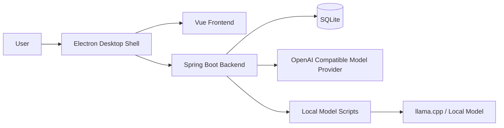
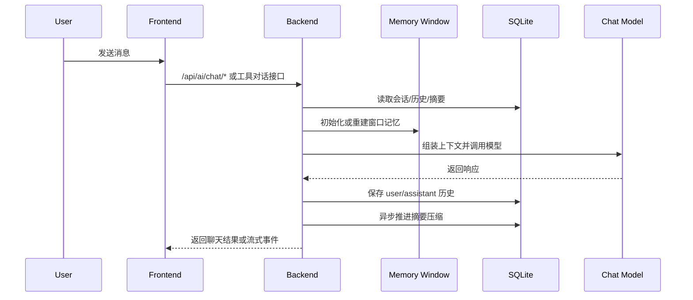

# Desktop Fairy

Desktop Fairy 是一个面向桌面场景的 AI 助手项目，当前采用"Spring Boot 后端 + Vue 前端 + Electron 桌面壳"的结构。

当前版本：`v0.3.0`

## v0.3.0 概览

当前版本已经形成可运行、可打包、可分发的桌面应用基础形态，重点能力包括：

- 多会话聊天与历史持久化
- 基于窗口记忆与摘要压缩的上下文管理
- 模型源配置、切换与测试
- OpenAI Compatible 模型接入
- 本地 llama.cpp 模型脚本集成
- Electron Windows 安装包打包
- 内置 JRE，安装版不依赖目标机器系统 Java
- 桌面精灵窗口形态与桌面壳运行链路
- 工具调用型对话链路（含流式工具状态回传与前端可视化）
- 更细粒度的上游模型服务错误分类能力
- 会话级文件附件授权与多模态图片注入
- 区域截图捕获（直接截图 / 隐藏窗口后截图）
- 附件预览（图片 / 文本格式点击预览）
- 临时闲聊模式（无需选择会话即可对话）


## 项目结构

```text
Desktop-Fairy
├─ src/                       # Spring Boot 后端源码
├─ frontend/                  # Vue + Vite + Electron 前端与桌面壳
│  ├─ electron/               # Electron 主进程、preload、截图覆盖窗口
│  └─ src/                    # Vue 页面、组件、状态、API 封装
├─ local-model-scripts/       # 本地模型安装/启动/停止脚本
├─ runtime/                   # 打包时随应用分发的运行时资源（当前包含 JRE）
├─ temp/                      # 打包或下载过程中的临时资源
├─ target/                    # Maven 构建产物
├─ pom.xml                    # 后端 Maven 配置
└─ README.md                  # 仓库总说明
```

## 技术栈

后端：

- Java 17
- Spring Boot 3.5.8
- Spring AI 1.1.2
- MyBatis-Plus 3.5.7
- SQLite
- MapStruct
- Lombok

前端与桌面端：

- Vue 3
- TypeScript
- Vite
- Pinia
- Electron
- electron-builder
- koffi

## 当前整体架构



## 核心能力

### 1. 聊天主链路



### 2. 会话记忆与摘要压缩

当前记忆分为两层：

- 窗口记忆：运行期内存结构，只服务当前对话上下文
- 持久化记忆：SQLite 中保存的历史与摘要，用于重启后恢复

摘要能力也分两层：

- 第一层：把尚未压缩的历史消息整理为摘要
- 第二层：当摘要数量继续积累时，对旧摘要再压缩

当前相关存储主要包括：

- `chat_history`
- `chat_summary`
- `chat_summary_cursor`
- `chat_session`

### 3. 模型源与本地模型链路

当前支持两类模型源：

- 在线 OpenAI Compatible 模型源
- 本地 `llama.cpp` 模型源

本地模型能力目前通过脚本集成，典型脚本包括：

- `install-local-test-model.bat`
- `start-local-test-model.bat`
- `stop-local-test-model.bat`

后端负责触发和记录脚本执行过程，前端负责展示状态与日志。

### 4. 桌面端链路

当前桌面版通过 Electron 套壳运行：

- 前端页面由 Vite 构建
- 后端 Jar 作为随应用分发资源启动
- 优先使用内置 JRE，而不是依赖用户本机 Java
- Windows 下桌面精灵拖动优先走 native 方案，失败时回退到 Electron 轮询方案

### 5. 工具调用对话链路

当前已搭建完整的工具调用型对话能力，包括：

- 工具调用事件流式回传前端（TOOL_STATUS / TOOL_RESULT / MEDIA_REQUEST_START）
- 轮次控制与上限控制（工具调用次数、执行时长、指令轮次限制）
- 前端可视化展示：TOOL_CALL 带工具名和 loading 动画的可折叠面板、TOOL_RESULT 绿色完成状态、MEDIA_REQUEST_START 图片处理状态提示
- 文件读取、图片注入、系统信息等基础工具
- 更细粒度的错误终止分类（工具上限、时间上限、指令上限、轮次上限）

### 6. 会话文件附件系统

当前支持为工作台会话授权文件附件，用于工具调用链路中读取和引用：

- **文件选择**：Electron 原生文件对话框，支持一次选择多文件
- **拖拽添加**：拖拽文件到输入框区域，支持多文件
- **粘贴添加**：Ctrl+V 粘贴文件，支持多文件
- **区域截图**：拖拽选择屏幕区域截图，支持直接截图和隐藏窗口后截图两种模式
- **附件预览**：点击附件 chip 预览，支持图片（png/jpg/webp/bmp/gif）和文本（txt/md/json/csv/code 等）格式
- **自动锁定工具调用**：有附件时工具调用自动开启并锁定，清空附件后解锁
- **发送后自动清除**：发送消息后附件 chip 自动清除，后端授权仍保留

文件授权通过 `/session-file` REST API 管理，与聊天请求解耦。

## 数据与配置

主要配置文件位于：

- `src/main/resources/application.yaml`
- `src/main/resources/application-datasource.yaml`
- `src/main/resources/application-filepath.yaml`
- `src/main/resources/application-log.yaml`
- `src/main/resources/application-mp.yaml`
- `src/main/resources/application-api.yaml`
- `src/main/resources/application-prompt.yaml`

当前建议把日志、数据库、本地模型文件等应用数据放在独立应用数据目录，而不是项目源码目录。这样更适合安装版运行，也更利于排查问题和后续清理。

## 本地开发

### 后端启动

```powershell
cd <repo-root>
mvn spring-boot:run
```

如果只打包后端：

```powershell
cd <repo-root>
mvn clean package "-Dmaven.test.skip=true"
```

### 前端启动

```powershell
cd <repo-root>/frontend
npm install
npm run dev
```

### Electron 开发模式

```powershell
cd <repo-root>/frontend
npm run desktop:dev
```

## Windows 安装包构建

### 前置条件

- Node.js 可用
- Maven 可用
- Electron 依赖已正确安装
- `runtime/jre/bin/java.exe` 已存在
- 后端可正常打出 Jar

### 打包步骤

1. 构建后端 Jar

```powershell
cd <repo-root>
mvn clean package "-Dmaven.test.skip=true"
```

2. 构建前端并打包 Windows 安装包

```powershell
cd <repo-root>/frontend
npm run desktop:pack
```

### 打包产物

主要产物位于：

- `frontend/release/Desktop Fairy Setup 0.3.0.exe`
- `frontend/release/win-unpacked/`

含义：

- `Desktop Fairy Setup 0.3.0.exe`：Windows 安装包，适合分发测试
- `win-unpacked/`：免安装目录版，适合本机调试和问题排查

## 分发建议

当前推荐这样分发：

- 面向普通测试用户：发送安装包 `Desktop Fairy Setup 0.3.0.exe`
- 面向技术同学排查问题：同时提供 `win-unpacked` 目录压缩包

建议同时说明：

- 首次启动可能需要等待数秒
- 当前版本主要面向 Windows 测试
- 如启动失败，请反馈系统版本、安装路径、报错截图和日志
- 本地模型安装能力依赖额外网络与环境条件，不作为基础可用性的唯一判断标准

## README 组织约定

当前建议保留两层 README：

- 根目录 `README.md`：全局说明、架构、构建、分发、版本概况
- `frontend/README.md`：前端与 Electron 开发、打包细节

后续如果新增独立模块说明文档，建议保持“总 README 负责导航，模块 README 负责细节”的结构，不要把所有信息都堆到单个文档里。

## 当前状态

截至 `v0.3.0`，项目已经具备下面这些可验证能力：

- 可构建 Windows 安装包
- 可随安装包分发 JRE
- 可在目标机器上不依赖系统 Java 启动后端
- 可运行前后端主聊天链路
- 可管理模型源并接入本地模型脚本
- 可进行工具调用型对话，前端完整展示工具调用/结果/图片处理状态
- 可为会话添加文件附件并预览（图片/文本）
- 可通过区域截图添加屏幕截图附件
- 可在临时闲聊模式下直接对话

当前仍建议继续完善的方向：

- Windows 代码签名
- 更稳妥的 API Key 存储方案
- 本地模型安装链路的可观测性
- 工具调用链路与桌面精灵业务继续细化
- 附件预览支持更多格式（PDF/DOCX/XLSX）
