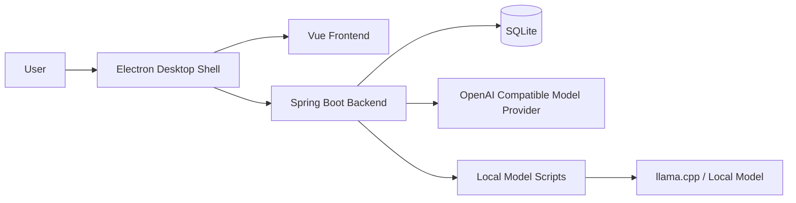
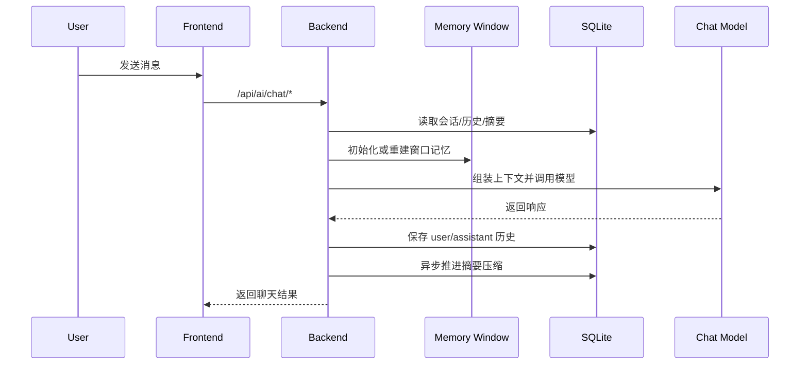

# Desktop Fairy

Desktop Fairy 是一个面向桌面场景的 AI 助手项目，当前采用“Java 后端 + Vue 前端 + Electron 桌面壳”的结构。

目前项目已经完成以下关键能力：

- 多会话聊天
- 历史消息持久化
- 窗口记忆与历史回填
- 摘要压缩与摘要再压缩
- 模型源配置与切换
- SQLite 本地存储
- Electron Windows 安装包打包
- 内置 JRE，安装版不依赖用户本机 Java
- 本地模型辅助脚本集成

当前仓库定位不是单纯的 Web 项目，而是一个可逐步演进为“可下载安装的桌面 AI 应用”的完整工程。

## 项目结构

```text
Desktop-Fairy
├─ src/                       # Spring Boot 后端源码
├─ frontend/                  # Vue + Vite + Electron 前端与桌面壳
├─ local-model-scripts/       # 本地模型安装/启动/停止脚本
├─ runtime/                   # 打包时随应用分发的运行时资源（当前包含 JRE）
├─ target/                    # Maven 构建产物
├─ pom.xml                    # 后端 Maven 配置
└─ README.md                  # 仓库总说明
```

## 技术栈

后端：

- Java 17
- Spring Boot 3.5.8
- Spring AI 1.1.2
- MyBatis-Plus 3.5.7
- SQLite
- MapStruct
- Lombok

前端与桌面端：

- Vue 3
- TypeScript
- Vite
- Pinia
- Electron
- electron-builder

## 当前整体架构



## 核心链路

### 1. 聊天链路



### 2. 会话记忆链路

当前记忆分为两层：

- 窗口记忆：运行期内存结构，只服务当前对话上下文
- 持久化记忆：SQLite 中保存的历史与摘要，用于重启后恢复

启动或切换会话时，后端会从历史消息中回填最近若干条，重建窗口记忆，而不是把整个对话都长期保存在内存中。

### 3. 摘要压缩链路

摘要逻辑分两层：

- 第一层：把尚未压缩的历史消息按阈值整理为摘要
- 第二层：当摘要过多时，再把旧摘要继续合并压缩

对应存储大致包括：

- `chat_history`
- `chat_summary`
- `chat_summary_cursor`
- `chat_session`

### 4. 本地模型链路

本地模型能力目前通过脚本完成，后端负责触发：

- `install-local-test-model.bat`
- `start-local-test-model.bat`
- `stop-local-test-model.bat`

这部分是增强能力，不属于桌面版基础启动链路。

## 数据与配置

### 数据库存储

当前项目已迁移到 SQLite，本地数据文件通过 Spring Boot 配置决定位置。

主要配置文件位于：

- `src/main/resources/application.yaml`
- `src/main/resources/application-datasource.yaml`
- `src/main/resources/application-filepath.yaml`
- `src/main/resources/application-log.yaml`
- `src/main/resources/application-mp.yaml`
- `src/main/resources/application-api.yaml`
- `src/main/resources/application-prompt.yaml`

数据库初始化采用 SQL 脚本机制。

### 日志与数据目录

当前建议把日志、数据库、本地模型相关文件都放在用户机器上的独立应用数据目录，而不是项目源码目录。

这样做有两个目的：

- 安装后运行路径稳定
- 删除程序时更容易识别哪些是应用生成数据

## 本地开发

### 后端启动

```powershell
cd E:\develop\idea\Desktop-Fairy
mvn spring-boot:run
```

如果只打包后端：

```powershell
cd E:\develop\idea\Desktop-Fairy
mvn clean package "-Dmaven.test.skip=true"
```

### 前端启动

```powershell
cd E:\develop\idea\Desktop-Fairy\frontend
npm install
npm run dev
```

### Electron 开发模式

```powershell
cd E:\develop\idea\Desktop-Fairy\frontend
npm run desktop:dev
```

## Windows 安装包构建

### 前置条件

- Node.js 可用
- Maven 可用
- Electron 依赖已正确安装
- `runtime/jre/bin/java.exe` 已存在

### 打包步骤

1. 构建后端 Jar

```powershell
cd E:\develop\idea\Desktop-Fairy
mvn clean package "-Dmaven.test.skip=true"
```

2. 构建前端资源并准备桌面打包资源

```powershell
cd E:\develop\idea\Desktop-Fairy\frontend
npm run desktop:pack
```

### 打包产物

主要产物位于：

- `frontend/release/Desktop Fairy Setup 0.1.0.exe`
- `frontend/release/win-unpacked/`

含义：

- `Desktop Fairy Setup 0.1.0.exe`：Windows 安装包，适合分发给测试用户
- `win-unpacked/`：免安装目录版，适合自测和排查问题

## 分发建议

当前推荐这样分发：

- 面向普通测试用户：发送安装包 `Desktop Fairy Setup 0.1.0.exe`
- 面向技术同学排查问题：同时提供 `win-unpacked` 目录压缩包

建议附带一段简短说明：

- 首次启动可能需要等待数秒
- 如启动失败，请反馈系统版本、安装路径、报错截图
- 当前本地模型安装能力依赖额外网络与环境条件，不作为基础可用性的唯一判断标准

## README 组织建议

当前仓库建议保留两层 README：

- 根目录 `README.md`：全局说明、架构、构建、分发
- `frontend/README.md`：前端与 Electron 开发细节

不建议把所有内容混成一个超长文档，也不建议保留乱码或过期说明。

## 当前状态

截至当前，这个项目已经具备下面的测试分发能力：

- 可构建 Windows 安装包
- 可随安装包分发 JRE
- 可在目标机器上不依赖系统 Java 启动后端
- 可作为桌面应用运行前后端主链路

仍建议继续完善的方向：

- Windows 代码签名
- 更稳定的 API key 存储
- 本地模型安装链路的错误处理
- 安装后日志与数据目录的显式说明
- 正式版本号管理与更新策略
